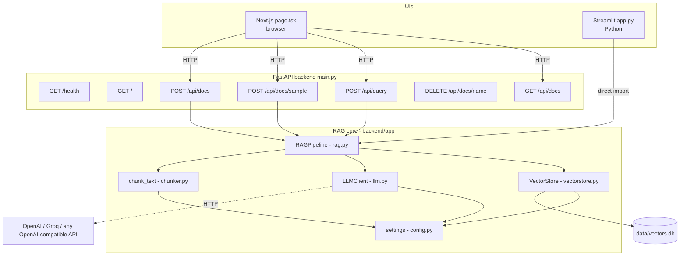
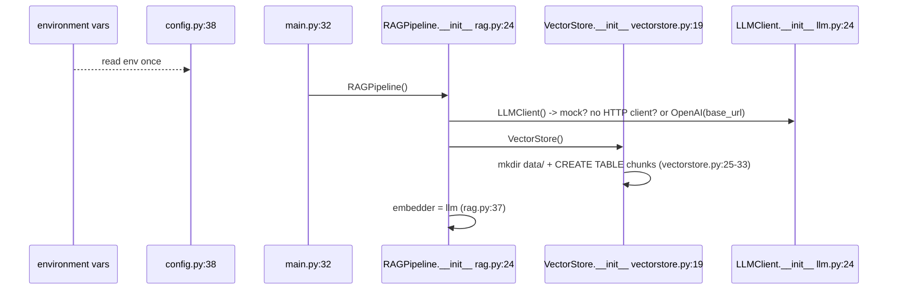
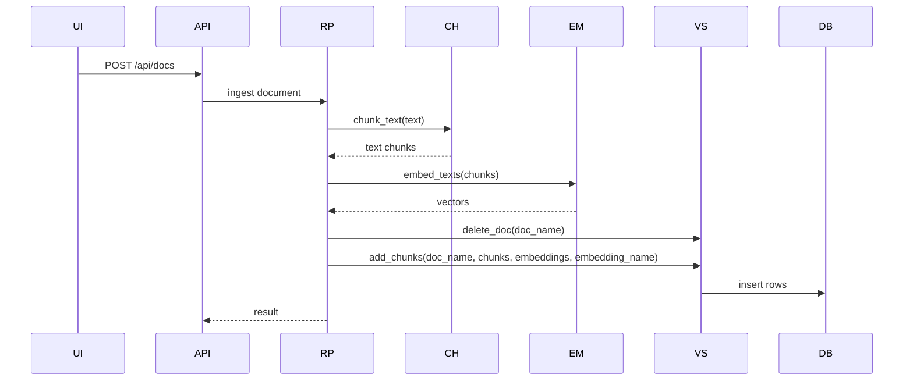
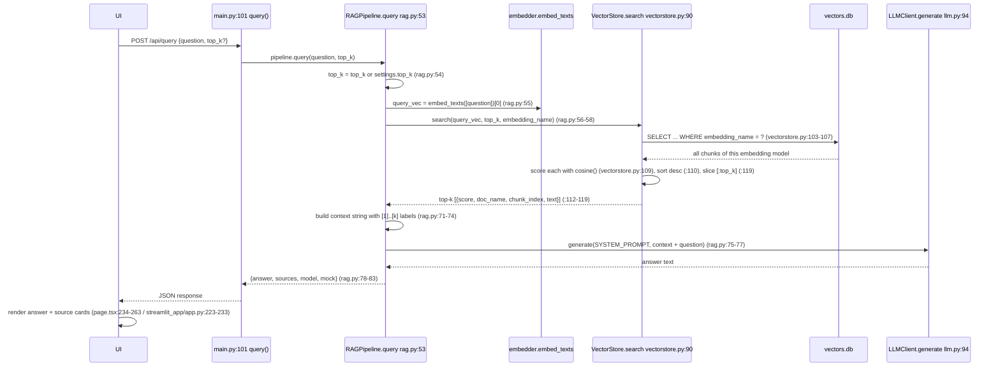

# Basic RAG — Architecture

This document traces the **entire system, file by file and line by line**:
how data flows between modules, how the process boots, how the ingest
pipeline chunks and embeds documents, how a question is retrieved against,
and how the top-k chunks are fetched and turned into a grounded answer.

Every claim is anchored to a `file:line` reference so you can open the code
and follow along. All line numbers were verified against the current tree.

---

## 1. System overview

Basic RAG is one RAG pipeline with **three front doors**:

```
                          ┌────────────────────────────────────────────┐
                          │         frontend/app/page.tsx             │
                          │         (Next.js on Vercel)               │
                          │          POST /api/query                  │
                          └────────────────────┬───────────────────────┘
                                               │ HTTP (JSON)
                          ┌────────────────────┴───────────────────────┐
                          │              backend/app/main.py           │
                          │           FastAPI on Render (:8000)        │
                          │                                           │
                          │   POST /api/docs/sample ──► RAGPipeline    │
                          │   POST /api/docs        ──► RAGPipeline    │
                          │   POST /api/query       ──► RAGPipeline    │
                          └────────────────────┬───────────────────────┘
                                               │ imports (in-process)
          ┌────────────────────────────────────┴───────────────────────┐
          │              backend/app/ (the RAG core)                  │
          │                                                           │
          │   rag.py        RAGPipeline      (orchestrator)           │
          │   chunker.py    chunk_text       (split docs)             │
          │   llm.py        LLMClient        (embed + generate)       │
          │   vectorstore.py VectorStore      (SQLite + cosine)       │
          │   config.py     settings          (env config)            │
          └───────┬───────────────────────────────────────────────────┘
                  │ SQLite
                  ▼
          backend/data/vectors.db   (the "vector database")
```

A second front door is the **Streamlit app** (`streamlit_app/app.py`), which
skips HTTP entirely: it imports the same `backend/app/*` modules in-process
(`streamlit_app/app.py:28-36`), shares the same SQLite file, and swaps the
embedder/LLM freely from its sidebar.



**The two phases.** Everything the system does is one of these:

| Phase | What happens | Where |
|---|---|---|
| **INGEST** (once per document) | text → chunks → vectors → stored in SQLite | `RAGPipeline.ingest` → `chunker.chunk_text` → `LLMClient.embed_texts` → `VectorStore.add_chunks` |
| **QUERY** (per question) | question → vector → top-k chunks → prompt → LLM answer | `RAGPipeline.query` → `embed_texts` → `VectorStore.search` → `LLMClient.generate` |

---

## 2. Module map (every file's role)

| File | Role | Key symbols (with anchors) |
|---|---|---|
| `backend/app/config.py` | Single source of truth for all tunables; reads env vars | `Settings` class `config.py:11-38`, singleton `settings` `config.py:38`, `chunk_size` `config.py:19`, `top_k` `config.py:21`, `db_path` `config.py:25`, `mock_mode` `config.py:32-35` |
| `backend/app/chunker.py` | Splits documents into overlapping chunks (paragraph → sentence → hard cut) | `chunk_text` `chunker.py:18-45`, `_split_long_paragraph` `chunker.py:48-69`, `_tail` `chunker.py:72-73` |
| `backend/app/llm.py` | OpenAI-compatible client for **embeddings** and **chat**; mock fallback | `LLMClient.__init__` `llm.py:24-45`, `embedding_name` `llm.py:47-57`, `embed_texts` `llm.py:62-69`, `_mock_embed` `llm.py:71-89`, `generate` `llm.py:94-109` |
| `backend/app/vectorstore.py` | SQLite "vector DB": table, insert, delete, list, cosine search | `VectorStore.__init__` (schema) `vectorstore.py:19-39`, `add_chunks` `vectorstore.py:49-64`, `delete_doc` `vectorstore.py:66-68`, `list_docs` `vectorstore.py:70-85`, `search` `vectorstore.py:90-120`, `cosine` `vectorstore.py:123-128` |
| `backend/app/rag.py` | Orchestrates the whole pipeline; builds the prompt; formats the answer | `SYSTEM_PROMPT` `rag.py:15-20`, `RAGPipeline.__init__` `rag.py:24-37`, `ingest` `rag.py:40-50`, `query` `rag.py:53-83` |
| `backend/app/main.py` | HTTP API: routes, CORS, request validation | `app` `main.py:23`, CORS `main.py:25-30`, `pipeline` singleton `main.py:32`, `QueryRequest` `main.py:37-39`, routes `main.py:45-105` |
| `backend/app/sample_docs.py` | 5 bundled documents that explain RAG itself | `DOCS` `sample_docs.py:7` |
| `streamlit_app/app.py` | Self-contained Python UI; sidebar config; local-embedding support | imports `streamlit_app/app.py:28-36`, `LocalEmbedder` `:72-90`, `build_pipeline` `:93-108`, ingest buttons `:166-175`, query `:217-233` |
| `frontend/app/page.tsx` | Next.js chat UI (client component) | `API_URL` `page.tsx:5`, `ask` `page.tsx:61-82`, `loadSamples` `:84-98`, `upload` `:100-120`, sources rendering `:234-263` |
| `frontend/app/layout.tsx` | App shell + metadata | `layout.tsx:1-19` |
| `frontend/app/globals.css` | Styling only (no logic) | — |
| `render.yaml` | Render blueprint: build/start commands, env | `render.yaml:5-32` |

Dependency direction — config is the leaf, everything reads it; the pipeline
composes the rest:

```
config.py ◄── chunker.py   (chunk_size, chunk_overlap)
     ◄────── llm.py        (key, urls, models, dim)
     ◄────── vectorstore.py(db_path)
     ◄────── rag.py        (top_k, chat_model)
     ◄────── main.py       (cors_origins, models, sizes)

main.py ──► rag.py ──► chunker.py / llm.py / vectorstore.py
```

---

## 3. Boot: what happens when the process starts

Everything is wired at import time — this is the whole "execution" of a
cold start:

1. `config.py:38` instantiates `settings = Settings()`, which reads every
   environment variable once. Values: `chunk_size=500`, `chunk_overlap=50`,
   `top_k=4`, `embedding_dim=1536`, `db_path=backend/data/vectors.db`,
   `mock_mode = (no API key set)` (`config.py:32-35`). The API key is read
   from `GROQ_API_KEY` (falls back to `OPENAI_API_KEY`), the base URL
   defaults to `https://api.groq.com/openai/v1`, and the default models are
   Groq's `llama-3.3-70b-versatile` (chat) and `nomic-embed-text-v1_5`
   (embeddings).
2. `main.py:23` builds the FastAPI app; `main.py:25-30` installs CORS with
   `settings.cors_origins`.
3. `main.py:32` runs `pipeline = RAGPipeline()`.
4. Inside `RAGPipeline.__init__` (`rag.py:24-37`):
   - `rag.py:35` → `LLMClient()` (`llm.py:24-45`). If no API key: `mock=True`
     and no HTTP client is created (`llm.py:41-44`); otherwise an `OpenAI`
     client is pinned to `base_url` — Groq by default (`llm.py:44`).
   - `rag.py:36` → `VectorStore()` (`vectorstore.py:19-39`). It `mkdir`s the
     `data/` directory (`vectorstore.py:21`) and executes
     `CREATE TABLE IF NOT EXISTS chunks (...)`, schema at
     `vectorstore.py:25-33`, plus a compatibility `ALTER TABLE`
     (`vectorstore.py:35-38`) and an index on `doc_name`
     (`vectorstore.py:39`). **The database is created lazily at first use
     — this is the only persistent state in the system.**
   - `rag.py:37` → `embedder = llm` (the LLM client embeds too, unless a
     custom embedder is injected — the Streamlit app does exactly that,
     `streamlit_app/app.py:107`).

Boot order diagram:



The **Streamlit** process boots the same way (`streamlit_app/app.py:161-163`
calls `build_pipeline`, which constructs `LLMClient` + `RAGPipeline`,
`:101-108`), and the **Next.js** process boots independently — it only talks
to the API over HTTP, so it never imports Python modules.

---

## 4. Phase A — INGEST: chunking, embedding, storing

### 4.1 Entry points (all roads lead to `RAGPipeline.ingest`)

| Action (UI) | UI code | HTTP/entry | Handler | Calls |
|---|---|---|---|---|
| "Load sample docs" (web) | `page.tsx:84-98` | `POST /api/docs/sample` | `main.py:83-89` | `pipeline.ingest` per doc (`main.py:85`) |
| Upload .txt/.md (web) | `page.tsx:100-120` | `POST /api/docs` (multipart) | `main.py:71-80` | validates extension `main.py:73-78`, decodes UTF-8 `main.py:79`, `pipeline.ingest` `main.py:80` |
| "Load sample docs" (Streamlit) | `streamlit_app/app.py:166-169` | none (in-process) | — | `pipeline.ingest` `:168` |
| Upload (Streamlit) | `streamlit_app/app.py:170-175` | none | — | `pipeline.ingest` `:174` |
| Sample docs data itself | — | — | — | `sample_docs.py:7` (`DOCS` dict, 5 docs) |

### 4.2 The ingest pipeline, step by step



**Data shape at each hop:**

- `str` — the whole document, up to MBs
- `list[str]` — chunked text, for example: `['chunk 0', 'chunk 1', ...]`, each chunk is about 500 characters
- `list[list[float]]` — one vector per chunk, with one vector per embedding dimension
- `SQLite row` — `(id, doc_name, chunk_index, text, embedding(json), embedding_name)`

### 4.3 Chunking in detail (`chunker.py`)

`chunk_text(text, chunk_size, overlap)` — `chunker.py:18-45`:

1. Defaults come from config (`chunker.py:21-22`): `chunk_size=500`,
   `overlap=50`.
2. Normalize line endings and split into **paragraphs** on blank lines:
   `re.split(r"\n\s*\n", …)` (`chunker.py:24-26`). Empty input returns `[]`
   (`chunker.py:27-28`).
3. Greedy fill: while a paragraph fits in the remaining budget
   (`chunker.py:33`), append it to the current chunk (`chunker.py:34`).
4. When the next paragraph would overflow (`chunker.py:36-37` flush the
   current chunk):
   - if the paragraph is itself bigger than `chunk_size`
     (`chunker.py:38`), delegate to `_split_long_paragraph`
     (`chunker.py:48-69`);
   - otherwise start a new chunk, **pre-seeded with the last
     `overlap` characters of the previous chunk** — `_tail` at
     `chunker.py:42` → `_tail` defined `chunker.py:72-73` — so facts that
     straddle the boundary exist in both chunks.
5. `_split_long_paragraph` splits on sentence boundaries
   (`chunker.py:49`, regex `(?<=[.!?。！？])\s+`), same greedy fill
   (`chunker.py:55-60`); a single sentence longer than `chunk_size` is hard
   cut into fixed-size pieces (`chunker.py:61-64`).

Worked example (defaults 500/50): a 1,200-char document of three paragraphs
(300 + 700 + 200 chars) becomes: chunk A = para 1 (300) → para 2 doesn't
fit (300+700 > 500) so flush A; para 2 is long → sentence-split into B
(≈500) and C (≈200, seeded with B's last 50 chars via `_tail`, `chunker.py:66`);
`current` resets to `""` after a long paragraph (`chunker.py:40`), so D = para
3 alone. Result: 4 chunks, boundaries at paragraphs/sentences, overlap at
the B/C seam.

### 4.4 Embedding in detail (`llm.py` + the Streamlit `LocalEmbedder`)

`LLMClient.embed_texts` (`llm.py:62-69`):

- **Live mode**: one batched API call
  `POST {base_url}/embeddings` with `model=embedding_model`
  (`llm.py:66-68`), returns `[d.embedding for d in response.data]`
  (`llm.py:69`) — a `list[float]` of e.g. 1536 dimensions.
- **Mock mode** (no key): `_mock_embed` (`llm.py:71-89`) builds a
  deterministic bag-of-words vector per text: lowercase words + 2/3-grams
  are hashed onto vector dimensions and counted (`llm.py:78-87`), then
  L2-normalized (`llm.py:88-89`). Texts sharing words land close — the
  whole retrieval demo works with zero API cost.
- `embedding_name` (`llm.py:47-57`) is a stable tag — `"mock-hash"` in mock
   mode, otherwise `"{model}@{host}"` (e.g.
   `nomic-embed-text-v1_5@api.groq.com`). This tag is stored with every
   chunk and used as a retrieval filter (see §6.3).

The Streamlit app can inject `LocalEmbedder` (`streamlit_app/app.py:72-90`)
instead: a local `sentence-transformers` model (`all-MiniLM-L6-v2`, 384 dims)
running on your machine — no API call, works offline. Its tag
`local:all-MiniLM-L6-v2` (`:83-84`) distinguishes it from API embeddings.

### 4.5 Storing in detail (`vectorstore.py`)

`add_chunks` (`vectorstore.py:49-64`) does a single batched `executemany`
(`vectorstore.py:57-63`): one row per chunk with the vector **serialized as
a JSON string** in the `embedding` column (`vectorstore.py:61`). `delete_doc`
(`vectorstore.py:66-68`) removes all chunks of a doc — `RAGPipeline.ingest`
calls it first (`rag.py:46`), so **re-ingesting a document replaces it**,
it never duplicates.

After ingesting all 5 sample docs you get 20 rows (as the API reports:
`main.py:86-89`).

---

## 5. Phase B — QUERY: retrieval + generation

### 5.1 Entry points

| Action (UI) | UI code | HTTP/entry | Handler | Calls |
|---|---|---|---|---|
| Ask (web) | `ask()` `page.tsx:61-82`, form `:206-221`, suggestions `:222-228` | `POST /api/query` | `main.py:101-105` | `pipeline.query(req.question, top_k=req.top_k)` `main.py:103` |
| Ask (Streamlit) | `st.chat_input` `streamlit_app/app.py:217`, query call `:225` | none (in-process) | — | `pipeline.query(question, top_k=top_k)` `:225` |

Request validation: `QueryRequest` (`main.py:37-39`) — `question` required
(1–2000 chars), `top_k` optional (1–20); if omitted, the server uses the
config default.

### 5.2 The query pipeline, step by step



**Data shape at each hop:**

- `str` — the user question
- `list[float]` — the query vector, matching the stored embedding dimensions
- `list[dict]` — the top-k retrieved chunks with score, doc name, chunk index, and text
- `str` — the assembled prompt containing the context plus the question
- `str` — the final answer with citations such as `[1]` and `[2]`

### 5.3 The empty-knowledge-base branch

If no chunks match the embedding tag (`rag.py:60`), the pipeline returns a
friendly message with empty sources instead of calling the LLM
(`rag.py:60-69`). The API surfaces this as `"status": "empty"`
(`main.py:104`), and the Streamlit UI shows it via `st.info`
(`streamlit_app/app.py:229-230`).

---

## 6. How top-k retrieval actually works (the heart of RAG)

`VectorStore.search` (`vectorstore.py:90-120`) — four steps:

### 6.1 Load candidates

```python
rows = conn.execute(
    "SELECT doc_name, chunk_index, text, embedding FROM chunks "
    "WHERE embedding_name = ?",          # vectorstore.py:105
    (embedding_name,),
).fetchall()
```

The `embedding_name` filter (`vectorstore.py:104-106`) is the correctness
guard: vectors from different embedding models live in different vector
spaces, so comparing them is meaningless. Only chunks produced by the *same*
model as the query participate (see `llm.py:47-57` for how the tag is
derived). For hundreds of chunks this scans everything — deliberate; a real
vector DB uses an ANN index (see §9).

### 6.2 Score every candidate with cosine similarity

```python
scored = [(cosine(query_vec, json.loads(r["embedding"])), r) for r in rows]  # :109
scored.sort(key=lambda pair: pair[0], reverse=True)                          # :110
```

`cosine(a, b)` (`vectorstore.py:123-128`): the dot product of the two
vectors divided by the product of their lengths:

```
            a · b        Σ aᵢ·bᵢ
cos(a,b) = ─────── = ───────────────────  ∈ [-1, 1]
            ‖a‖·‖b‖   √(Σaᵢ²)·√(Σbᵢ²)
```

Each stored vector is deserialized from its JSON column
(`vectorstore.py:109`), compared with the query vector, and the pair is
remembered with its score.

### 6.3 Take the top-k

```python
return [ {...} for score, r in scored[:top_k] ]  # vectorstore.py:112-119
```

The list is already sorted descending by score (`:110`); the slice
`scored[:top_k]` (`:119`) keeps exactly the `top_k` best, and each result
carries `score` (rounded to 4 decimals, `:114`), `doc_name`, `chunk_index`,
and the chunk `text` itself — everything the UI needs to render a source
card.

Worked example (mock mode, `top_k=3`), question *"What is a good chunk
size?"* — verified against the running API:

```
candidate                      score (cosine)
chunking-strategies / chunk 3      0.3256   ← best match
chunking-strategies / chunk 0      0.2397
how-embeddings-work   / chunk 0    0.2385
…further chunks                    lower
```

After the sort (`vectorstore.py:110`) and slice (`vectorstore.py:119`), the
response's `sources` array holds exactly these three entries, best first.
The API reports status `"ok"` when `sources` is non-empty (`main.py:104`).

### 6.4 Turn sources into a prompt (`rag.py:71-77`)

```python
context = "\n\n".join(
    f"[{i + 1}] ({r['doc_name']}, chunk {r['chunk_index']})\n{r['text']}"
    for i, r in enumerate(sources))        # rag.py:71-74
answer = self.llm.generate(
    SYSTEM_PROMPT, f"Context:\n{context}\n\nQuestion: {question}")   # rag.py:75-77
```

Every source is labelled `[1]..[k]` with its provenance. `SYSTEM_PROMPT`
(`rag.py:15-20`) then instructs the LLM to answer **only** from the context,
to say "I don't know" rather than invent, and to **cite sources as [1]…[n]**.

### 6.5 Generation (`llm.py:94-109`)

Live mode: `chat.completions.create` (`llm.py:101-108`) with
`messages=[system, user]` and `temperature=0.2`; the answer is
`response.choices[0].message.content` (`llm.py:109`). Mock mode: the context
is echoed back with an explanation banner (`llm.py:95-100`).

The response returned to the UI (`rag.py:78-83`) is:
`{answer, sources: [...top_k...], model, mock}` — the UI renders the answer
and, next to it, the source cards with similarity bars
(`page.tsx:239-262`, `streamlit_app/app.py:61-69, 226-228`).

---

## 7. Configuration and provider flexibility

All behavior is env-driven (`config.py:11-38`), so the identical code runs
locally, on Render, or with a different provider:

| Env var | Default | Effect |
|---|---|---|
| `GROQ_API_KEY` (falls back to `OPENAI_API_KEY`) | empty | empty → **mock mode** (`config.py:32-35`) |
| `OPENAI_BASE_URL` | `https://api.groq.com/openai/v1` | any OpenAI-compatible endpoint — Groq by default (`llm.py:36-44`) |
| `EMBEDDING_MODEL` | `nomic-embed-text-v1_5` | Groq's embedding model (`llm.py:38,66-68`) |
| `CHAT_MODEL` | `llama-3.3-70b-versatile` | Groq's fast chat model (`llm.py:38,101`) |
| `CHUNK_SIZE` / `CHUNK_OVERLAP` | `500` / `50` | chunker budget (`chunker.py:21-22`) |
| `TOP_K` | `4` | default slice size (`rag.py:54`, `vectorstore.py:119`) |
| `DB_PATH` | `backend/data/vectors.db` | SQLite location (`vectorstore.py:20`) |
| `CORS_ORIGINS` | `*` | allowed browser origins (`main.py:27`) |

The **Streamlit** app overrides these at runtime from the sidebar instead
(`streamlit_app/app.py:117-156`) and passes them straight into
`LLMClient(...)` (`:101-106`) — which is why the same backend code can serve
Groq, OpenAI, or a local model without touching `config.py`.

---

## 8. Deployment wiring

| Layer | Config | Notes |
|---|---|---|
| Backend → Render | `render.yaml` | `rootDir: backend` `render.yaml:9`; `startCommand: uvicorn app.main:app --host 0.0.0.0 --port $PORT` `render.yaml:11`; `healthCheckPath: /health` `render.yaml:12`; `GROQ_API_KEY` marked `sync: false` (set in dashboard) `render.yaml:17-18` |
| Web UI → Vercel | `frontend/` (auto-detected) | `NEXT_PUBLIC_API_URL` is baked into the bundle at build time (`page.tsx:5`) — set it as a Vercel env var pointing at the Render URL |
| Streamlit → Community Cloud | `streamlit_app/app.py` + secrets | `GROQ_API_KEY` read via `st.secrets` (`streamlit_app/app.py:119`) |

**Statelessness caveat:** Render free tier uses an ephemeral disk — the
SQLite file at `DB_PATH` can be wiped on restart, so sample docs must be
re-ingested after a cold start (`config.py:25`, `main.py:85`). The
architecture is "file-as-vector-store" on purpose: swapping SQLite for a
managed vector DB changes only `vectorstore.py`.

---

## 9. Extension points

- **Real vector database**: replace `VectorStore.search` internals
  (`vectorstore.py:90-120`) with an ANN query (Qdrant, pgvector, Upstash…);
  `RAGPipeline` and everything above it is untouched.
- **Reranker**: between `search` and prompt assembly (`rag.py:56` → `rag.py:71`),
  re-score the top ~50 candidates with a rerank model.
- **New providers**: nothing to change — any OpenAI-compatible endpoint
  works via `OPENAI_BASE_URL`; add a custom embedder class behind
  `embed_texts`/`embedding_name` (like `LocalEmbedder`,
  `streamlit_app/app.py:72-90`).
- **Streaming**: `LLMClient.generate` (`llm.py:94-109`) is the single choke
  point to switch to SSE/token streaming.
- **Multi-user**: add a `namespace` column next to `embedding_name`
  (`vectorstore.py:25-33`) and thread it through `search` like the
  embedding filter (`vectorstore.py:104-106`).
